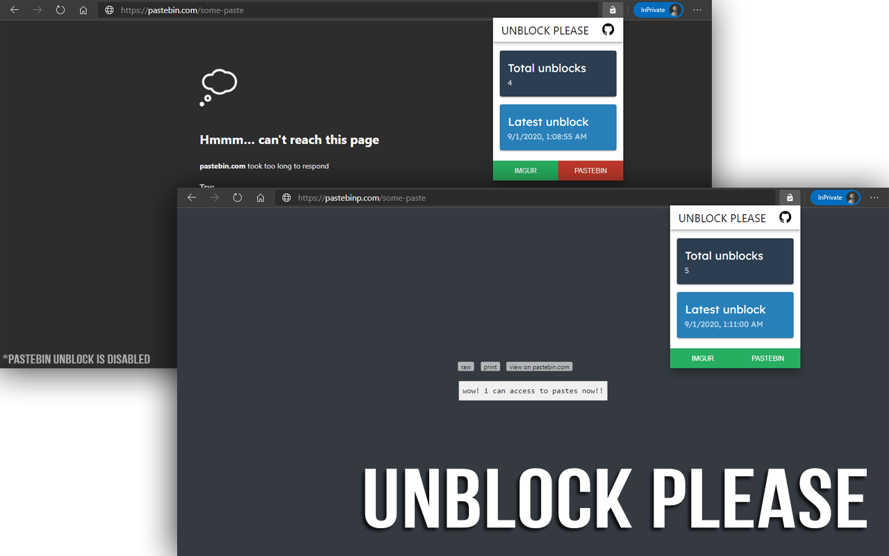

  
  
  

  
  
  

## ℹ️ About

Unblock Please is an extension that you can use to bypass Pastebin and Imgur blockages put by your ISP, country or unsecure connection by using different proxies!

It's 100% safe and it's open source! You can review the code from this repository and you customize it as much as you want! You can also use this project's system to unblock other websites blocked for you for some reasons. Check our [changelogs](https://github.com/eggsydev/imgur-please/blob/master/CHANGELOGS.md) to see what's new!

## 💦 Features

- Simple switch to disable which sites you don't want extension to work on.
- See your stats, total unblocked images and last time Unblock Please helped you to unblock a request!

## Screenshots

## 🔧 Bugs

Please report!

## 💁🏻 Feature Requests

You can use issues of this repository to request a feature! It's free, trust me. You can also make it by yourself and send a pull request! I can speak **Turkish** too!

## 💥 Extension Links

[Chrome Web Store](https://chrome.google.com/webstore/detail/imgur-please/lpngbkmgnehdkkobdbieckjpphkohffd)

If you're interested to help, check the [Contributing](https://github.com/eggsydev/imgur-please/blob/master/CONTRIBUTING.md) page!

### Sponsors

  

